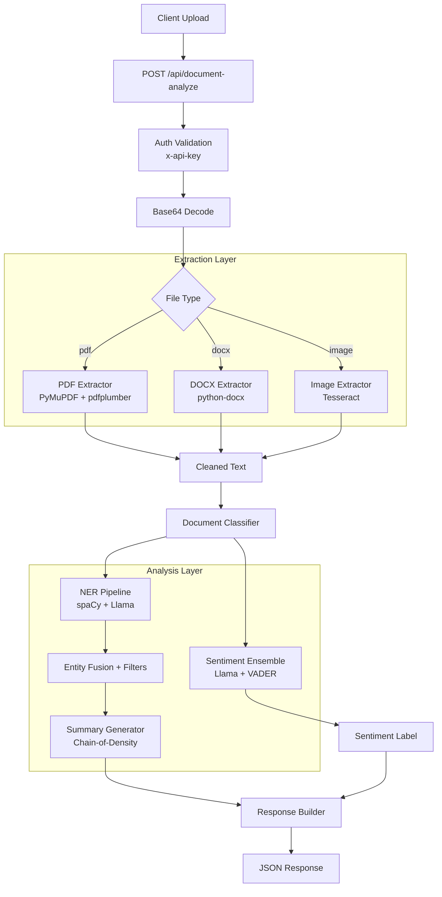
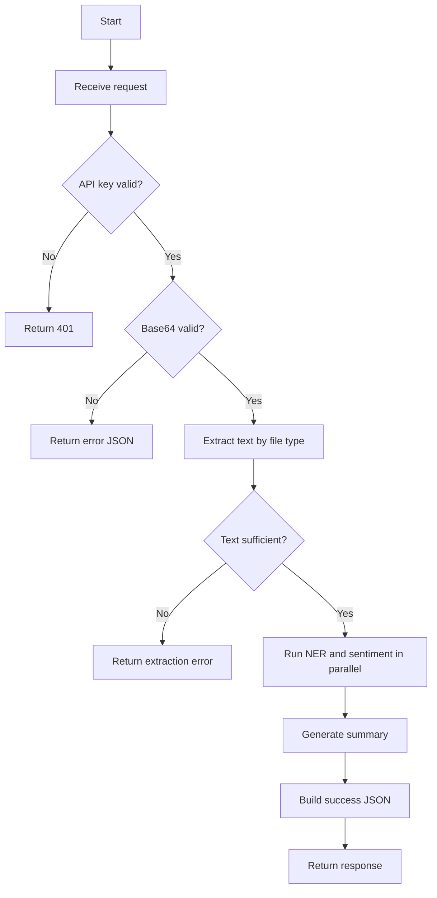

# Data Extraction API

DocuMind AI is a production-ready document intelligence platform for extracting structured insights from PDF, DOCX, and image files.

## Description

Intelligent document processing API that accepts PDF, DOCX, and image files, extracts text, identifies named entities, classifies sentiment, and generates AI-powered summaries using a multi-model pipeline.

## Hackathon Compliance Matrix

| Requirement                                                                | Status      | Evidence                                  |
| -------------------------------------------------------------------------- | ----------- | ----------------------------------------- |
| Endpoint `POST /api/document-analyze`                                      | Implemented | API Contracts section                     |
| Auth header `x-api-key` with 401 on invalid/missing                        | Implemented | API Contracts + runtime behavior          |
| Request `fileName`, `fileType`, `fileBase64`                               | Implemented | API Contracts section                     |
| Response includes `status`, `fileName`, `summary`, `entities`, `sentiment` | Implemented | Success response (official spec shape)    |
| Sentiment limited to Positive/Neutral/Negative                             | Implemented | Core Capabilities + API contract          |
| README includes Description, Tech Stack, Setup Instructions, Approach      | Implemented | Required sections present                 |
| AI tools disclosure present                                                | Implemented | AI Tools Used section                     |
| No hardcoded response mapping                                              | Implemented | Dynamic extraction/summarization pipeline |

## Live Demo

- API URL: https://your-deployment.railway.app
- Frontend: https://your-frontend.railway.app
(Update these URLs after deployment)

## Tech Stack

- Framework: FastAPI (Python 3.11)
- NER Layer 1: spaCy en_core_web_sm
- NER Layer 2: Llama 3.3 70B via Groq API
- Summarization: Llama 3.3 70B via Groq API (Chain-of-Density)
- Sentiment: Llama 3.3 70B via Groq API + VADER ensemble
- OCR: Tesseract (pytesseract) with multi-PSM fallback strategy
- PDF: PyMuPDF + pdfplumber
- DOCX: python-docx
- Cache: Redis
- Queue: Celery
- Deploy: Docker -> Railway / Render

## Setup Instructions

1. Clone the repository
2. `cp .env.example .env` and fill in `GROQ_API_KEY` and `API_KEY`
3. Get free Groq API key at https://console.groq.com
4. `docker compose up --build`
5. API ready at http://localhost:8000/api/document-analyze

Quick health check:

```bash
curl http://localhost:8000/health
```

## Approach

- Text extraction strategy by file format:
  - PDF: PyMuPDF page-by-page with pdfplumber fallback, scanned pages auto-detected and sent to Tesseract OCR
  - DOCX: paragraph, heading, and table-aware extraction
  - Image: Tesseract with contrast/sharpness preprocessing, tries PSM 6 -> PSM 3 -> PSM 11 for maximum coverage
- NER strategy:
  - Two-layer fusion (spaCy sm baseline + Llama 3.3 70B), merged with fuzzy deduplication
- Sentiment strategy:
  - Llama 3.3 70B primary with document-type context prompt + VADER fallback
  - Neutral-bias calibration for formal documents
- Summary strategy:
  - Chain-of-Density prompting anchored to extracted entities for factual accuracy

## System Diagram



## End-to-End Flowchart



## Core Capabilities

- Multi-format ingestion: PDF, DOCX, JPG, JPEG, PNG
- Entity extraction: names, dates, organizations, amounts
- Sentiment output strictly from: Positive, Neutral, Negative
- Adaptive factual summarization
- Redis-backed caching and async worker support

## What Judges Should Evaluate First

1. API authenticity: send different files and observe non-hardcoded, content-dependent outputs
2. OCR resilience: test scanned/visual documents and compare extracted entities
3. Error handling: test invalid API keys, invalid base64, and low-text files
4. Operational readiness: verify Docker startup, health endpoint, and frontend integration

## API Contracts

### Endpoint

- Method: POST
- Path: `/api/document-analyze`
- Header: `x-api-key: YOUR_SECRET_API_KEY`

Missing or invalid API key returns 401.

### Request Body

```json
{
  "fileName": "sample1.pdf",
  "fileType": "pdf",
  "fileBase64": "<base64>"
}
```

`fileType` values: `pdf | docx | image`

### Success Response (Official Spec Shape)

```json
{
  "status": "success",
  "fileName": "sample1.pdf",
  "summary": "...",
  "entities": {
    "names": ["Ravi Kumar"],
    "dates": ["10 March 2026"],
    "organizations": ["ABC Pvt Ltd"],
    "amounts": ["₹10,000"]
  },
  "sentiment": "Neutral"
}
```

### Error Response

```json
{
  "status": "error",
  "message": "..."
}
```

### Example Request

```bash
curl -X POST https://your-deployment.railway.app/api/document-analyze \
  -H "Content-Type: application/json" \
  -H "x-api-key: YOUR_API_KEY" \
  -d '{
    "fileName": "report.pdf",
    "fileType": "pdf",
    "fileBase64": "<base64_encoded_content>"
  }'
```

### Example Response

```json
{
  "status": "success",
  "fileName": "report.pdf",
  "summary": "...",
  "entities": {
    "names": [],
    "dates": [],
    "organizations": ["Google", "Microsoft"],
    "amounts": []
  },
  "sentiment": "Positive"
}
```

## Project Structure Note

This project uses `app/` instead of the spec's suggested `src/`, following FastAPI best practices with proper package separation.
The entry point is `app/main.py` exposed via uvicorn.

## Project Structure

```text
.
├── app/
│   ├── extractors/
│   ├── processors/
│   ├── routers/
│   ├── services/
│   ├── models/
│   ├── utils/
│   └── main.py
├── frontend/
├── tests/
├── eval/
├── requirements.txt
├── .env.example
├── Dockerfile
└── docker-compose.yml
```

## Environment Variables

### Backend (.env)

- `GROQ_API_KEY` (required)
- `API_KEY` (required)
- `REDIS_URL` (default: `redis://localhost:6379`)
- `ENVIRONMENT` (default: `development`)
- `LOG_LEVEL` (default: `INFO`)
- `USE_CACHE` (default: `true`)
- `USE_LOCAL_LLM` (default: `false`)
- `LOCAL_LLM_URL` (default: `http://localhost:11434`)
- `MAX_FILE_SIZE_MB` (default: `50`)
- `REQUEST_TIMEOUT_SECONDS` (default: `300`)

### Frontend (frontend/.env.local)

- `NEXT_PUBLIC_API_URL`
- `NEXT_PUBLIC_API_KEY`

## Testing and Validation

```bash
python -m py_compile $(find app tests workers -name '*.py')
pytest -q tests/test_api.py tests/test_entities.py tests/test_sentiment.py tests/test_extractors.py
python run_sample_test.py
```

## Deployment Notes

- Deploy backend container and Redis with Docker/compose
- Set required secrets on hosting platform
- Set frontend API URL and API key env vars
- Verify health endpoint: `GET /health`

Production verification checklist:

```bash
# 1) Backend health
curl https://your-api-domain.com/health

# 2) Auth enforcement (should be 401)
curl -X POST https://your-api-domain.com/api/document-analyze \
  -H "Content-Type: application/json" \
  -d '{"fileName":"x.pdf","fileType":"pdf","fileBase64":"eA=="}'

# 3) Frontend build check
cd frontend && npm run build
```

## Final Submission Checklist

- [ ] Public GitHub repo URL added to submission form
- [ ] Live deployment URL updated in README
- [ ] `README.md`, `requirements.txt`, `.env.example`, and backend source are present
- [ ] `.env` is not tracked by git
- [ ] API key validation returns 401 for invalid/missing key
- [ ] AI tools disclosure section is present
- [ ] At least one successful API demo call is validated after deployment

## AI Tools Used

(Mandatory disclosure — required by hackathon rules)

| Tool               | Purpose                                                  |
| ------------------ | -------------------------------------------------------- |
| GitHub Copilot Pro | Code generation and implementation                       |
| Claude (claude.ai) | Architecture design, model selection, technical strategy |

All AI-generated code was reviewed, tested, and validated.
Architecture decisions and system design were human-directed.

## Known Limitations

- Very large documents (>10,000 words) may have slower response
- Handwritten text in images may have reduced OCR accuracy
- Non-English documents not currently supported

## License

MIT
