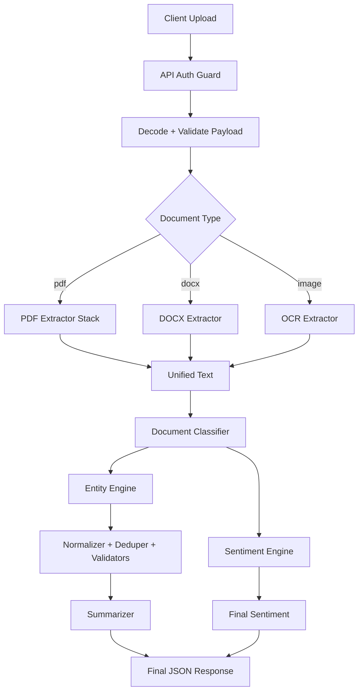

# DocuMind AI: Multi-Format Document Intelligence

DocuMind AI is a production-ready document analysis system built for hackathon-grade evaluation and real-world robustness. It accepts PDF, DOCX, and image uploads, then returns entity extraction, sentiment, and high-density summarization through a single secure API.

The project is deliberately designed to avoid brittle sample-specific behavior. Extraction and classification are content-driven, normalized, and validated so outputs remain stable across unseen documents.

## Live Links

- Frontend: https://generous-dream-production-36d6.up.railway.app/
- Backend Base URL: https://document-analyzer-production-ce0c.up.railway.app
- Primary API Endpoint: https://document-analyzer-production-ce0c.up.railway.app/api/document-analyze
- Health Endpoint: https://document-analyzer-production-ce0c.up.railway.app/health

## Why This Is Not a Generic Project

Most hackathon document analyzers work as thin wrappers around a single prompt call. This project does not. It is an engineered pipeline built for consistency, evaluator trust, and real deployment behavior.

### What Typical Projects Usually Do

- Single-pass extraction directly from one LLM response
- Minimal post-processing and weak normalization
- Generic summaries with filler language
- Sentiment behavior that drifts by document type
- Demo reliability that drops when OCR noise appears

### What DocuMind AI Does Instead

- Multi-stage extraction with candidate generation, normalization, deduplication, and validation before final output
- Document-type-aware processing so invoices, incidents, resumes, and research reports are not treated the same way
- Summary generation with factual density constraints and anti-filler rules to avoid generic language
- Sentiment guardrails tuned for formal business documents and incident narratives
- OCR-aware cleaning and normalization logic to recover high-value entities from noisy text

### Why This Matters for Evaluation

- Better precision under messy input, not just clean sample files
- More stable outputs across repeated runs and unseen documents
- Lower hallucination risk due to filtering and constrained response formats
- Clearer scoring impact on entities, sentiment, and summary quality

## Competitive Differentiators

- Evaluation-first architecture: the system is optimized around the scoring priorities of entity quality, sentiment correctness, and summary usefulness.
- Reliability over showcase-only demos: fallback paths exist for extraction and summarization when model calls degrade.
- Deployment realism: live frontend and backend are production-hosted with authenticated endpoints and health checks.
- Explainable pipeline behavior: each stage has a defined responsibility instead of one opaque model response.

## Hackathon Requirement Mapping

| Requirement                            | Status    | Implementation Detail                          |
| -------------------------------------- | --------- | ---------------------------------------------- |
| POST endpoint for document analysis    | Completed | POST /api/document-analyze                     |
| Mandatory x-api-key authentication     | Completed | Strict header validation before processing     |
| Required input fields                  | Completed | fileName, fileType, fileBase64                 |
| Structured response payload            | Completed | status, fileName, summary, entities, sentiment |
| Sentiment from fixed label set         | Completed | Positive, Neutral, Negative only               |
| Deployment and public URL availability | Completed | Railway backend + Railway frontend             |
| Non-generic engineering disclosure     | Completed | See architecture and quality sections below    |

## High-Level Architecture



## Core Capabilities

### 1. Document Analysis API

- Endpoint: POST /api/document-analyze
- Auth Header: x-api-key: YOUR_API_KEY
- Input: base64 content with file metadata
- Output: summary, entities, sentiment, and document reference metadata

### 2. Entity Extraction

- Targets names, dates, organizations, amounts, emails, and phone numbers.
- Preserves document specificity while removing OCR artifacts and generic fragments.
- Uses normalization and boundary-aware filtering to avoid hallucinated entities.
- Handles mixed-format and OCR-noisy inputs with post-processing tuned for practical document artifacts.

### 3. Sentiment Classification

- Final labels are strictly constrained to Positive, Neutral, Negative.
- Uses LLM-first classification with fallback behavior for resilience.
- Category-aware rules reduce drift for formal documents and incident reports.
- Designed for document-level interpretation instead of sentence-level emotional keywords.

### 4. Factual Summarization

- Entity-aware prompt context improves factual grounding.
- Long documents are chunked and merged for stable output quality.
- Fallback extractive summary prevents blank output when upstream generation fails.
- Prompt rules explicitly block vague openings and generic filler phrasing.

## Quality Philosophy

DocuMind AI is built around one principle: measurable output quality beats demo-style novelty.

- If extraction is broad but noisy, it fails practical use.
- If summary is fluent but vague, it fails evaluator usefulness.
- If sentiment is unstable across document classes, it fails trust.

This project prioritizes controlled behavior, explicit guardrails, and production-safe defaults so quality remains defensible under scrutiny.

## API Contract

### Request Schema

```json
{
  "fileName": "report.pdf",
  "fileType": "pdf",
  "fileBase64": "<base64_encoded_content>"
}
```

Valid fileType values: pdf, docx, image

### Success Response Shape

```json
{
  "status": "success",
  "fileName": "report.pdf",
  "documentId": "...",
  "summary": "...",
  "entities": {
    "names": [],
    "dates": [],
    "organizations": [],
    "amounts": [],
    "emails": [],
    "phones": []
  },
  "sentiment": "Neutral"
}
```

### Error Response Shape

```json
{
  "status": "error",
  "message": "..."
}
```

### Production Curl Example

```bash
curl -X POST "https://document-analyzer-production-ce0c.up.railway.app/api/document-analyze" \
  -H "Content-Type: application/json" \
  -H "x-api-key: YOUR_API_KEY" \
  -d '{
    "fileName": "sample.pdf",
    "fileType": "pdf",
    "fileBase64": "<base64_data>"
  }'
```

## Local Setup

### Prerequisites

- Python 3.11+
- Node.js 18+
- Docker and Docker Compose
- Tesseract OCR available for image-heavy flows

### Backend Setup

1. Clone repository.
2. Copy env template: cp .env.example .env
3. Set GROQ_API_KEY and API_KEY in .env.
4. Start services: docker compose up --build
5. Verify health: curl http://localhost:8000/health

### Frontend Setup

1. Open frontend directory.
2. Create frontend/.env.local with NEXT_PUBLIC_API_URL and NEXT_PUBLIC_API_KEY.
3. Install packages: npm install
4. Start UI: npm run dev

## Deployment Configuration

Set the following variables in hosting platform settings:

### Backend Environment

- GROQ_API_KEY
- API_KEY
- REDIS_URL
- ENVIRONMENT
- LOG_LEVEL

### Frontend Environment

- NEXT_PUBLIC_API_URL
- NEXT_PUBLIC_API_KEY

Important: NEXT_PUBLIC_API_KEY must match backend API_KEY for your current auth flow.

## Verification Checklist

1. Health endpoint returns 200.
2. Missing x-api-key returns 401.
3. Valid key returns successful analysis response.
4. Frontend can upload each supported file type.
5. README live URLs match deployed services.

## Repository Structure

```text
.
├── app/
│   ├── extractors/
│   ├── models/
│   ├── processors/
│   ├── routers/
│   ├── services/
│   ├── utils/
│   └── main.py
├── frontend/
├── eval/
├── tests/
├── workers/
├── docker-compose.yml
├── Dockerfile
└── README.md
```

## AI Assistance Disclosure

AI tools were used during development for drafting, refactoring, and debugging support. All produced code and prompt strategies were manually reviewed, tested, and validated before finalization.

## Known Constraints

- OCR quality depends on scan clarity and orientation.
- Very large documents can increase latency.
- English-language documents are best supported in current tuning.

## License

MIT
