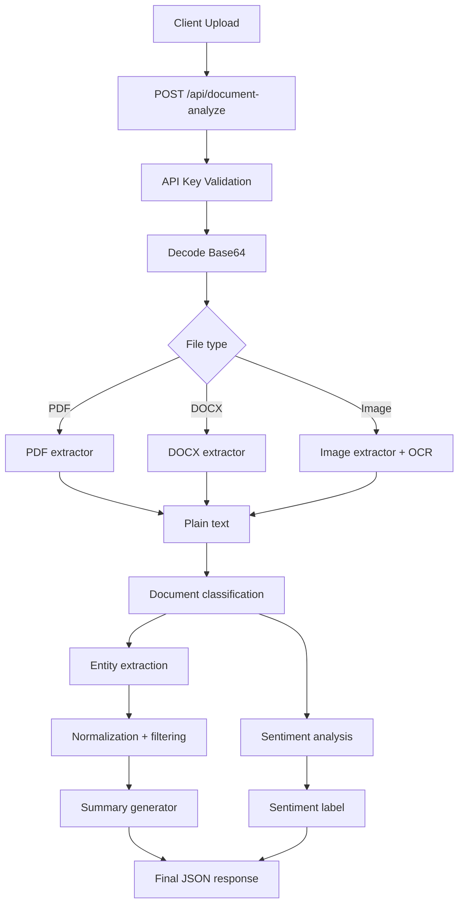

# DocuMind AI

DocuMind AI is a document intelligence API for PDFs, DOCX files, and images. It extracts structured entities, summarizes the document, and returns a sentiment label while keeping the pipeline generic across document types.

## What It Does

The system accepts a base64-encoded document, extracts text with format-specific parsers, runs entity extraction across the full document, and returns a strict JSON response. The entity pipeline is not tied to sample documents or hardcoded mappings; it uses candidate generation, normalization, deduplication, and validation to maximize recall without allowing vague fragments through.

## Highlights

- `POST /api/document-analyze` for full-document analysis.
- `x-api-key` authentication with `401` on missing or invalid keys.
- OCR support for scanned images and image-heavy PDFs.
- Entity extraction for names, dates, organizations, amounts, emails, and phone numbers.
- Sentiment output constrained to `Positive`, `Neutral`, or `Negative`.
- Document-scoped Q&A endpoint backed by cached text rather than heavy vector infrastructure.
- Docker-based deployment with Redis and background workers.

## Hackathon Compliance

| Requirement                                         | Status      | Notes                                                    |
| --------------------------------------------------- | ----------- | -------------------------------------------------------- |
| `POST /api/document-analyze`                        | Implemented | Primary analysis endpoint                                |
| `x-api-key` auth with 401 handling                  | Implemented | Enforced before processing                               |
| Request fields `fileName`, `fileType`, `fileBase64` | Implemented | Matches API contract                                     |
| Response includes required analysis payload         | Implemented | `status`, `fileName`, `summary`, `entities`, `sentiment` |
| Sentiment only in allowed labels                    | Implemented | `Positive`, `Neutral`, `Negative`                        |
| README contains description, stack, setup, approach | Implemented | This document                                            |
| AI disclosure included                              | Implemented | See AI Tools Used                                        |
| No hardcoded sample mapping                         | Implemented | Extraction is content-driven                             |

## Live Demo

- API URL: https://document-analyzer-production-ce0c.up.railway.app
- API Endpoint: https://document-analyzer-production-ce0c.up.railway.app/api/document-analyze
- Frontend URL: https://generous-dream-production-36d6.up.railway.app/

## Tech Stack

- Backend: FastAPI, Python 3.11
- Extraction: PyMuPDF, pdfplumber, python-docx, Tesseract OCR
- NLP: spaCy, Groq-hosted Llama 3.3 70B, VADER
- Storage and workers: Redis, Celery
- Frontend: Next.js 14, React, TypeScript
- Deployment: Docker, Docker Compose, Railway-compatible runtime

## Architecture



## Extraction Approach

- Text extraction is file-format aware, so PDFs, DOCX documents, and images each use the most reliable parser first.
- Entity extraction is generic. The code collects candidates from regex, spaCy, and the LLM, then removes noise through normalization and deduplication.
- Organization recall is tuned to keep real names like `Google`, `Microsoft`, and `NVIDIA` while rejecting vague fragments, OCR junk, and section-label text.
- Summary generation is entity-aware and chunked for long documents, but it does not force sample-specific outputs.
- Sentiment uses an ensemble with guardrails so factual or formal documents stay neutral unless the text clearly expresses sentiment.

## Setup

1. Clone the repository.
2. Copy the environment file: `cp .env.example .env`.
3. Add your `GROQ_API_KEY` and `API_KEY`.
4. Start the stack: `docker compose up --build`.
5. Open the API health check at `http://localhost:8000/health`.

Quick validation:

```bash
curl http://localhost:8000/health
```

## Environment Variables

### Backend (`.env`)

- `GROQ_API_KEY` required
- `API_KEY` required
- `REDIS_URL` default: `redis://localhost:6379`
- `ENVIRONMENT` default: `development`
- `LOG_LEVEL` default: `INFO`
- `USE_CACHE` default: `false`
- `USE_LOCAL_LLM` default: `false`
- `LOCAL_LLM_URL` default: `http://localhost:11434`
- `MAX_FILE_SIZE_MB` default: `50`
- `REQUEST_TIMEOUT_SECONDS` default: `300`

### Frontend (`frontend/.env.local`)

- `NEXT_PUBLIC_API_URL`
- `NEXT_PUBLIC_API_KEY`

## API Contract

### Endpoint

- Method: `POST`
- Path: `/api/document-analyze`
- Header: `x-api-key: YOUR_API_KEY`

### Request

```json
{
  "fileName": "report.pdf",
  "fileType": "pdf",
  "fileBase64": "<base64_encoded_content>"
}
```

`fileType` must be one of `pdf`, `docx`, or `image`.

### Success Response

```json
{
  "status": "success",
  "fileName": "report.pdf",
  "documentId": "...",
  "summary": "...",
  "entities": {
    "names": ["Nina Lane"],
    "dates": ["June 2020"],
    "organizations": ["Blue Horizon Media"],
    "amounts": ["30%"],
    "emails": ["nina@example.com"],
    "phones": ["1 234 567-8900"]
  },
  "sentiment": "Neutral"
}
```

### Error Response

```json
{
  "status": "error",
  "message": "..."
}
```

### Example Request

```bash
curl -X POST https://document-analyzer-production-ce0c.up.railway.app/api/document-analyze \
  -H "Content-Type: application/json" \
  -H "x-api-key: YOUR_API_KEY" \
  -d '{
    "fileName": "report.pdf",
    "fileType": "pdf",
    "fileBase64": "<base64_encoded_content>"
  }'
```

## Related Endpoints

- `GET /health` returns service health.
- `POST /api/document-qa` answers questions using the cached text of a previously analyzed document.

## Testing

```bash
python -m py_compile $(find app tests workers -name '*.py')
pytest -q tests/test_api.py tests/test_entities.py tests/test_sentiment.py tests/test_extractors.py
python run_sample_test.py
```

## Deployment Notes

- Run the backend and Redis together when deploying with Docker Compose.
- Set `GROQ_API_KEY`, `API_KEY`, `NEXT_PUBLIC_API_URL`, and `NEXT_PUBLIC_API_KEY` in your hosting environment.
- Confirm the health endpoint before wiring the frontend.
- The runtime has been slimmed to stay compatible with constrained platforms like Railway.

Production verification:

```bash
# Backend health
curl https://document-analyzer-production-ce0c.up.railway.app/health

# Auth enforcement
curl -X POST https://document-analyzer-production-ce0c.up.railway.app/api/document-analyze \
  -H "Content-Type: application/json" \
  -d '{"fileName":"x.pdf","fileType":"pdf","fileBase64":"eA=="}'

# Frontend build
cd frontend && npm run build
```

## Project Structure

```text
.
├── app/
│   ├── extractors/
│   ├── models/
│   ├── processors/
│   ├── routers/
│   ├── services/
│   ├── utils/
│   └── main.py
├── frontend/
├── tests/
├── eval/
├── requirements.txt
├── .env.example
├── Dockerfile
└── docker-compose.yml
```

## Final Submission Checklist

- [ ] GitHub repository URL added to the submission form.
- [ ] Live deployment URLs updated in this README.
- [ ] `.env` is not tracked by git.
- [ ] Backend starts successfully with Docker Compose.
- [ ] API key enforcement returns `401` when missing or invalid.
- [ ] At least one successful end-to-end API demo is verified.
- [ ] AI disclosure section remains present.

## AI Tools Used

| Tool           | Purpose                                    |
| -------------- | ------------------------------------------ |
| GitHub Copilot | Implementation assistance and code edits   |
| Claude         | Architecture review and technical strategy |

All AI-assisted work was reviewed, tested, and validated before being kept.

## Known Limitations

- Very large documents can take longer to analyze.
- Handwritten text remains less reliable than printed text.
- Non-English documents are not a primary target.

## License

MIT
